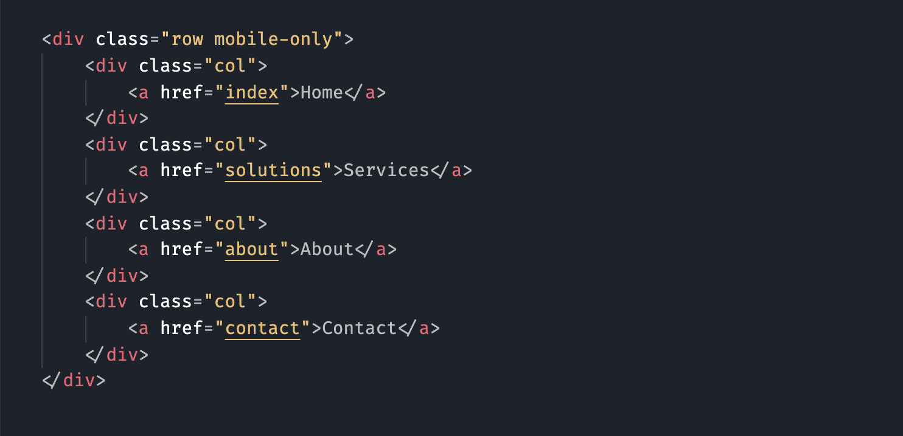
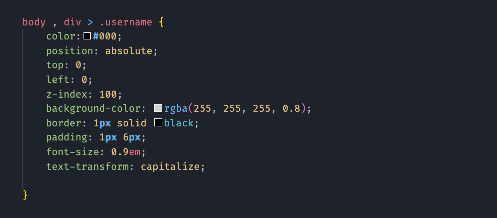
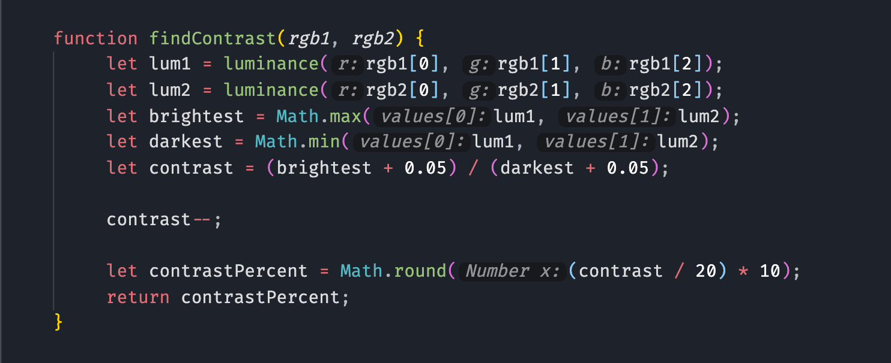

# Midnight code theme

A dark VS Code theme

[](https://marketplace.visualstudio.com/items?itemName=midnight-code)
[](https://marketplace.visualstudio.com/items?itemName=midnight-code)
[](https://marketplace.visualstudio.com/items?itemName=midnight-code)

## Install

Launch VS Code Quick Open (⌘+P), paste the following command, and press enter.  
ext install theme-github

Launch VS Code Quick Open (ctrl/⌘ + P) then run

```
ext install midnight-code
```

## Screenshot

Screenshot of HTML, CSS and JavaScript code



